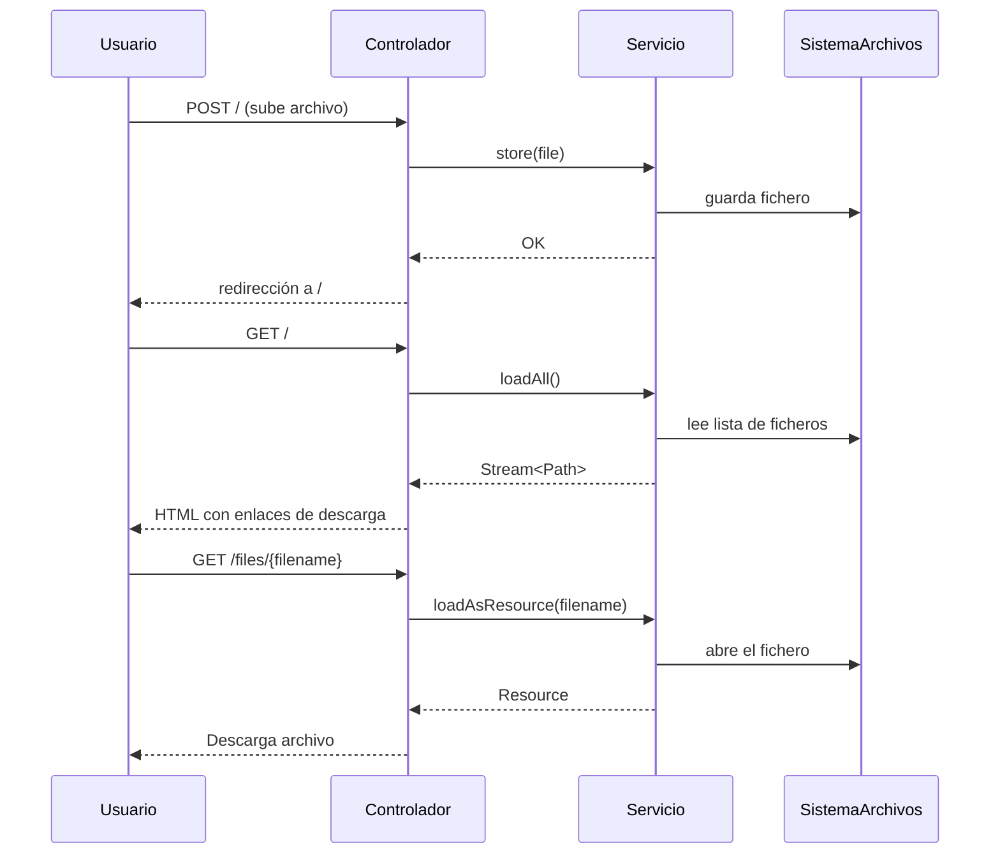

## 🧩 1. El servicio: `StorageService` y `FileSystemStorageService`

El **servicio** es la capa encargada de la **lógica de negocio**: guardar, leer, listar y borrar archivos.
Spring recomienda definir una **interfaz** y una **implementación**, porque así podrás cambiar la forma de almacenar los ficheros sin tocar el resto del código (por ejemplo, pasar de guardar en disco a guardar en la nube o en una base de datos).

---

### 🔹 1.1. Interfaz `StorageService`

Esta interfaz define **qué operaciones** puede hacer el servicio, sin decir **cómo** las hace.

```java
public interface StorageService {

    void init();  // Crea la carpeta de almacenamiento si no existe
    void store(MultipartFile file);  // Guarda un archivo recibido del formulario
    Stream<Path> loadAll();  // Devuelve un listado (Stream) con los archivos almacenados
    Path load(String filename);  // Devuelve la ruta absoluta de un archivo concreto
    Resource loadAsResource(String filename);  // Devuelve el archivo listo para ser descargado (como Resource)
    void deleteAll();  // Borra todo el contenido de la carpeta
}
```

#### 🧠 Explicación didáctica:

| Método             | Qué hace                                                                         | Cuándo se usa                                  |
| ------------------ | -------------------------------------------------------------------------------- | ---------------------------------------------- |
| `init()`           | Crea el directorio de subida si no existe.                                       | Al arrancar la aplicación.                     |
| `store()`          | Copia el contenido de un archivo (`MultipartFile`) en el disco.                  | Cuando el usuario sube un fichero.             |
| `loadAll()`        | Lista los ficheros ya guardados.                                                 | Cuando se quiere mostrar o devolver una lista. |
| `load()`           | Devuelve el `Path` concreto de un fichero.                                       | Paso intermedio antes de leer o descargar.     |
| `loadAsResource()` | Convierte ese fichero a `Resource`, que Spring sabe enviar en la respuesta HTTP. | Cuando se descarga un archivo.                 |
| `deleteAll()`      | Limpia todo el directorio (solo para desarrollo).                                | Al iniciar la app o para resetear.             |

---

### 🔹 1.2. Implementación `FileSystemStorageService`

Esta clase **implementa** todos los métodos anteriores, utilizando las clases de Java NIO (`Path`, `Files`, `UrlResource`, etc.).

Ejemplo simplificado:

```java
@Service
public class FileSystemStorageService implements StorageService {

    private final Path rootLocation;

    public FileSystemStorageService(StorageProperties properties) {
        this.rootLocation = Paths.get(properties.getLocation());
    }

    @Override
    public void init() {
        try {
            Files.createDirectories(rootLocation);
        } catch (IOException e) {
            throw new StorageException("No se pudo inicializar el almacenamiento", e);
        }
    }

    @Override
    public void store(MultipartFile file) {
        try {
            if (file.isEmpty()) {
                throw new StorageException("Fichero vacío");
            }
            Path destinationFile = this.rootLocation.resolve(
                    Paths.get(file.getOriginalFilename()))
                    .normalize().toAbsolutePath();

            if (!destinationFile.getParent().equals(this.rootLocation.toAbsolutePath())) {
                throw new StorageException("Intento de almacenar fuera del directorio permitido");
            }

            try (InputStream inputStream = file.getInputStream()) {
                Files.copy(inputStream, destinationFile, StandardCopyOption.REPLACE_EXISTING);
            }
        } catch (IOException e) {
            throw new StorageException("Fallo al almacenar el archivo " + file.getOriginalFilename(), e);
        }
    }

    @Override
    public Stream<Path> loadAll() {
        try {
            return Files.walk(this.rootLocation, 1)
                    .filter(path -> !path.equals(this.rootLocation))
                    .map(this.rootLocation::relativize);
        } catch (IOException e) {
            throw new StorageException("Fallo al leer archivos almacenados", e);
        }
    }

    @Override
    public Path load(String filename) {
        return rootLocation.resolve(filename);
    }

    @Override
    public Resource loadAsResource(String filename) {
        try {
            Path file = load(filename);
            Resource resource = new UrlResource(file.toUri());
            if (resource.exists() || resource.isReadable()) {
                return resource;
            } else {
                throw new StorageFileNotFoundException("No se pudo leer el archivo: " + filename);
            }
        } catch (MalformedURLException e) {
            throw new StorageFileNotFoundException("Archivo no encontrado: " + filename, e);
        }
    }

    @Override
    public void deleteAll() {
        FileSystemUtils.deleteRecursively(rootLocation.toFile());
    }
}
```

#### 🧠 Detalles importantes:

* `Files.walk(rootLocation, 1)` → recorre el directorio y devuelve un **Stream<Path>**.
  Se usa `1` para no recorrer subcarpetas.
* `Files.copy(...)` → guarda físicamente el archivo subido.
* `UrlResource` → convierte la ruta local en un recurso HTTP descargable.
* `StorageException` y `StorageFileNotFoundException` son excepciones personalizadas que facilitan el manejo de errores.

---

## 🚦 2. El controlador: `FileUploadController`

El **controlador** es quien conecta el **mundo HTTP (peticiones del usuario)** con el **servicio**.
Recibe los archivos, los pasa al servicio, devuelve respuestas o vistas.

Ejemplo típico:

```java
@Controller
public class FileUploadController {

    private final StorageService storageService;

    @Autowired
    public FileUploadController(StorageService storageService) {
        this.storageService = storageService;
    }

    @GetMapping("/")
    public String listUploadedFiles(Model model) throws IOException {
        model.addAttribute("files", storageService.loadAll().map(
                path -> MvcUriComponentsBuilder
                        .fromMethodName(FileUploadController.class, "serveFile", path.getFileName().toString())
                        .build().toUri().toString())
                .collect(Collectors.toList()));
        return "form";  // carga la página form.html o form.html en static
    }

    @GetMapping("/files/{filename:.+}")
    @ResponseBody
    public ResponseEntity<Resource> serveFile(@PathVariable String filename) {
        Resource file = storageService.loadAsResource(filename);
        return ResponseEntity.ok()
                .header(HttpHeaders.CONTENT_DISPOSITION,
                        "attachment; filename=\"" + file.getFilename() + "\"")
                .body(file);
    }

    @PostMapping("/")
    public String handleFileUpload(@RequestParam("file") MultipartFile file, RedirectAttributes redirectAttributes) {
        storageService.store(file);
        redirectAttributes.addFlashAttribute("message", "Subido correctamente: " + file.getOriginalFilename());
        return "redirect:/";
    }

    @ExceptionHandler(StorageFileNotFoundException.class)
    public ResponseEntity<?> handleStorageFileNotFound(StorageFileNotFoundException exc) {
        return ResponseEntity.notFound().build();
    }
}
```

---

### 🧠 Explicación didáctica:

| Método                        | HTTP                    | Descripción                                                                                                    |
| ----------------------------- | ----------------------- | -------------------------------------------------------------------------------------------------------------- |
| `listUploadedFiles()`         | `GET /`                 | Muestra la página con el formulario y la lista de archivos subidos. Usa `loadAll()` del servicio.              |
| `serveFile()`                 | `GET /files/{filename}` | Descarga un archivo concreto como `Resource`. Añade la cabecera `Content-Disposition` para forzar la descarga. |
| `handleFileUpload()`          | `POST /`                | Recibe el archivo del formulario (campo `file`) y lo guarda mediante `storageService.store(file)`.             |
| `handleStorageFileNotFound()` | —                       | Manejador de errores para cuando no se encuentra el archivo (devuelve 404).                                    |

---

### 📋 Flujo completo

1. El usuario abre `/` y se carga el formulario (`form.html` o Thymeleaf).
2. El usuario selecciona un archivo y pulsa “Subir”.
3. El navegador envía una petición `POST /` con el archivo como `multipart/form-data`.
4. El método `handleFileUpload()` guarda el archivo usando el servicio.
5. Redirige a `/`, donde `listUploadedFiles()` lista los archivos subidos.
6. El usuario ve los enlaces generados `/files/{filename}`.
7. Si hace clic, `serveFile()` descarga el archivo.

---

### 🧰 Errores y validaciones

* Si subes un archivo vacío → lanza `StorageException`.
* Si el nombre contiene `..` (intento de ataque) → también lanza excepción.
* Si intentas descargar un archivo inexistente → devuelve HTTP 404.

---

## 🧩 Resumen visual (Mermaid)



